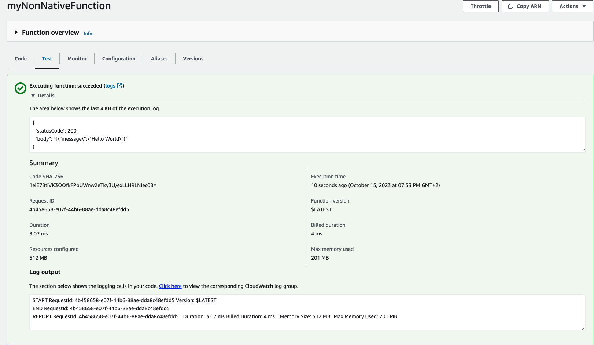
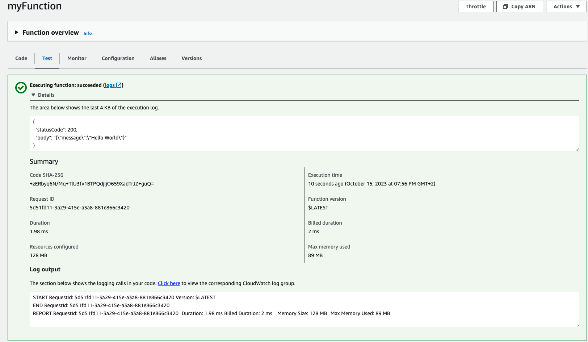

# micronaut-native-aws-lambda

#### As an experienced Java developer, i decided to try making an AWS lambda in the java language.

#### But after a few day i was wondering why the response times on my lambda were so up and down.

#### The answer is pretty simple :

#### AWS is like a big machine that shares computer time.

####  If a service, like a lambda, isn't used for a while, its running image will just be taken off and then started again when needed.

#### Amazon's Java 17 runtime performance is really good, but it has a big problem with performance the first time it starts.

#### This is basically where GraalVM comes in.

#### I heard really good things about GraalVM and the Micronaut framework .

#### But like any experienced developer, I wanted to see it by myself.

Here's the result of a simple test that you can easily do on an Amazon lambda using the code from this repository : 

#### Cold Start timings with the amazon Java 17 runtime :

#### Cold start timings with a graalVm native executable on an amazon custom image .

#### Warm start timings with the amazon 17 runtime :

#### Warm start timings with a graalVm native executable on an amazon custom image .

Cold Start with the amazon Java 17 runtime : 

Cold start with a graalVm native executable on an amazon custom image .

Warm start With the amazon 17 runtime :

Warm start with a graalVm native executable on an amazon custom image .

