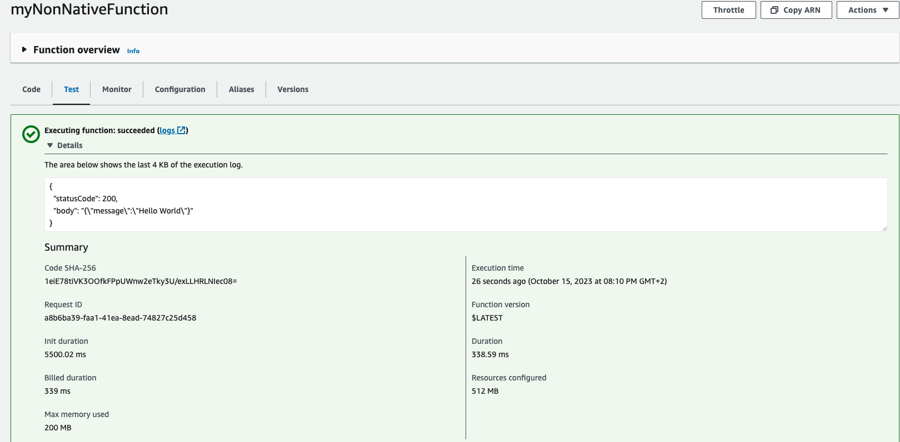
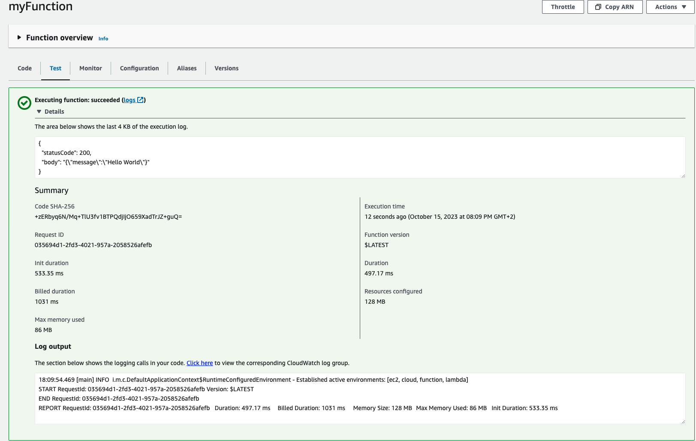

Welcome .

As an experienced Java developer, and I decided to try making an AWS lambda in this language.

But after a few day i was wondering why the response times on my lambda were so up and down.

And the answer is pretty simple :

You have to remember that AWS is like a big machine that shares computer time. 
If a service, like a lambda, isn't used for a while, its running image will just be taken off and then started again when needed.

To be honest, Amazon's Java 17 runtime is already really good, but it has a big problem with performance the first time it starts.

This is where GraalVM comes in.

With the amazon Java 17 runtime : 

With a graalVm native executable on an amazon custom image .

